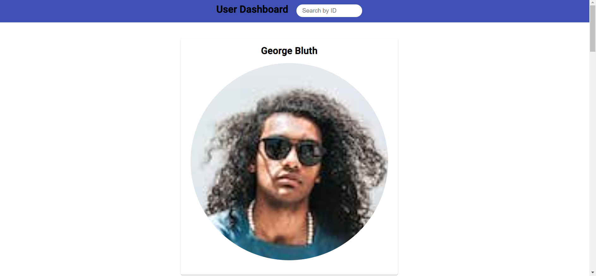
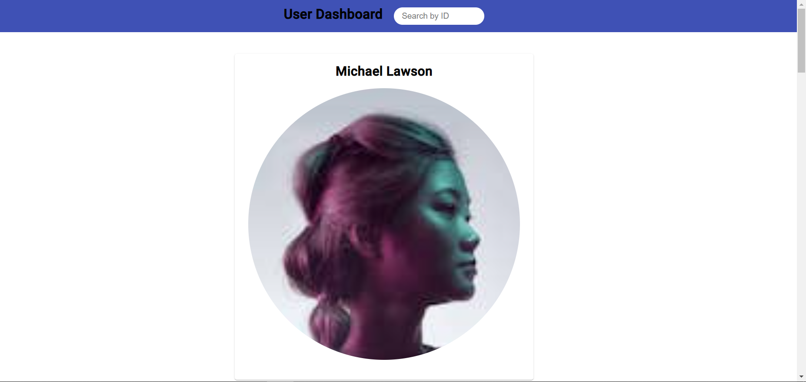
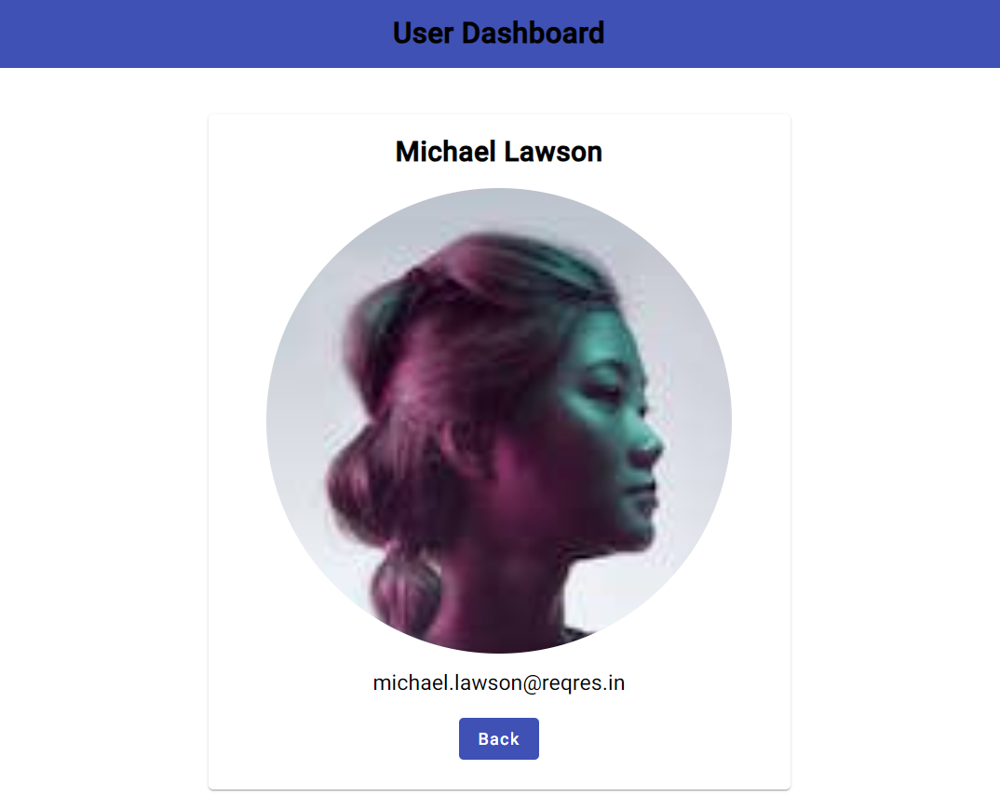

## live Link : https://dynamic-user-dashboard-task.netlify.app/

## UserDashboard
This project was generated with [Angular CLI](https://github.com/angular/angular-cli) version 16.2.14.

## Development server
Run `ng serve` for a dev server. Navigate to `http://localhost:4200/`. The application will automatically reload if you change any of the source files.

## Build
Run `ng build` to build the project. The build artifacts will be stored in the `dist/` directory.

## Features
page1

page2

page3

## Data Retrieval:
Fetch user card data from ReqRes API
Fetch detailed user information from ReqRes API

## Navigation:
Click user cards to navigate to a detailed user page
Back button on the user details page to return to the main user list

## Search Functionality:
Instant search by user ID in the header

## Caching:
Optimized performance with caching mechanisms to avoid redundant HTTP requests

## User Experience:
Loading bar for network request status
Smooth user interface 

## State Management:
Utilized NgRx for managing application state efficiently

## Observables:
Managed asynchronous operations using RxJS observables

## Styling:
Applied Angular Material components for consistent styling

## Project Structure
src/app/
  Contains page components
  (userlist, user-list-page2,
  user-details)
  
  services/ - Contains service for
  HTTP requests and caching
  
  store/ - Contains NgRx state
  management files

## Technologies Used
Angular 16
Angular Material
NgRx (for state management)
RxJS (for asynchronous operations)
SCSS (for styling)
AI tools
